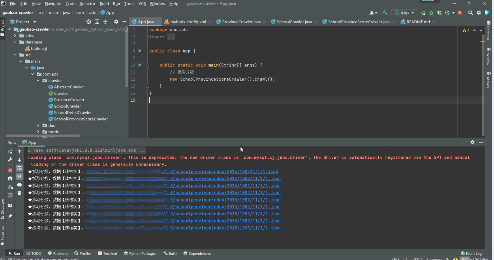

## 计算机毕业设计Python+Spark+Flink高考志愿推荐系统 高考大数据分析 高考爬虫可视化系统  大数据毕业设计 高考系统 高考志愿填写推荐系统 大数据毕业设计

## 要求
### 源码有偿！一套(论文 PPT 源码+sql脚本+教程)

https://www.bilibili.com/video/BV1oP411G7SU?spm_id_from=333.999.0.0

### 
### 加好友前帮忙start一下，并备注github有偿获取源码
### 我的QQ号是798059319或者 2827724252

# 麻烦几十块买代码或者白嫖的直接别来了！不缺你那几毛钱！全中国只有我卖大数据毕设(不信自己搜大数据毕业设计)！没人惯着你！

### 加qq好友说明（被部分 网友整得心力交瘁）：
    1.加好友务必按照格式备注
    2.避免浪费各自的时间！
    3.当“客服”不容易，repo 主是体面人，不爆粗，性格好，文明人。

## 开发技术
前端：vue.js、element-ui

后端：springboot+mybatis-plus

数据库：mysql

机器学习/算法：python、lstm情感分析、协同过滤算法(基于用户、基于物品全部实现)

数据集：Java爬虫(暂定，9月份上线Python爬虫)

第三方平台：百度AI图片识别、支付宝沙箱支付、短信接口

大数据分析：Spark、Flink

全中国首创自研Python+SpringBoot+Vue.js+Spark【大数据+web+机器学习】智能开发平台，不仅能够弥补开发者前后端分离网站开发的短板，还能迅速完成大数据、机器学习、算法的开发，我相信我的架构很快会在中国计算机毕业设计里面成为领军框架典范

## 创新点

1.Spark+Flink大屏统计数据可视化

2.短信验证码功能

3.lstm深度学习情感分析算法

4.推荐算法：协同过滤算法的基于物品、基于用户全部实现

5.身份证自动识别

6.支付宝沙箱支付

7.Java爬虫(Python爬虫9月份上线)

# 运行截图

# 运行视频(B站)

https://www.bilibili.com/video/BV1oP411G7SU?spm_id_from=333.999.0.0

